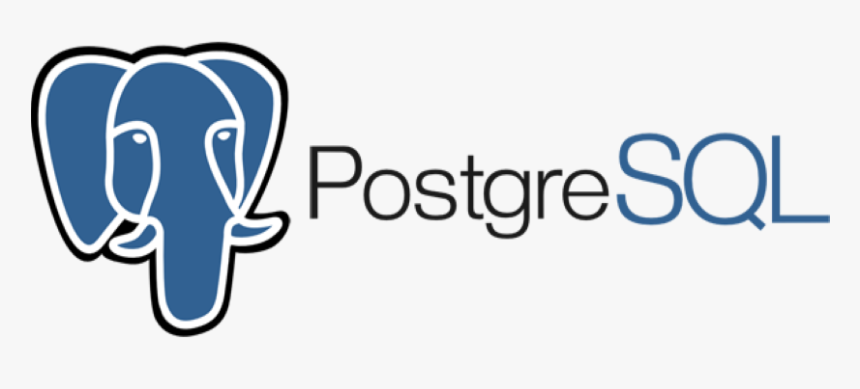
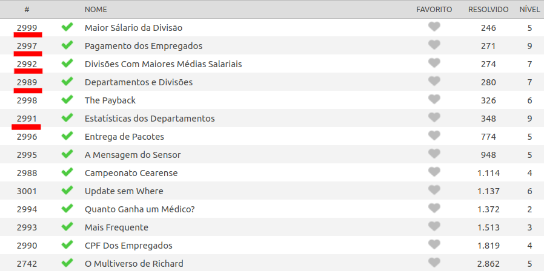
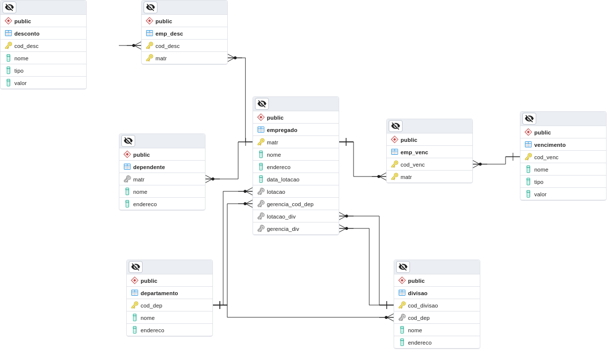

# Beecrowd Postgresql



# Sobre o repositório

<p align="center">


</p>

Este repositório possui todas as questões de sql, que foram publicadas até a data 15/03/2023, da plataforma [beecrowd](https://www.beecrowd.com.br/judge/pt).
Para resolver os problemas sem instalar o postgres diretamente na máquina foi 
criado o arquivo [docker-compose.yml](docker-compose.yml), que sobe 2 
containers: o do banco de dados postgres e o do pgadmin web. 


## Como usar o docker-compose.yml ?

Pré requisitos: 
- Possuir o docker e docker-compose instalado em sua máquina.

Como instalar o docker e o docker-compose no linux: [Tutorial](https://github.com/JoaoHenrique12/TutorialPostgreSQL/blob/main/DOCKER.md)

### Acessando o postgres

Subindo os containers e entrando no console do postgres já no banco de dados beecrowd.
```bash
$ # Lembre-se de estar na pasta raiz do projeto para executar os seguintes comandos.
$ docker-compose up -d
$ docker ps
$ # docker ps lista os container ativos e os seus respectivos ids.
$ docker exec -it <ID_DO_CONTAINER_POSTGRES:14.1-ALPINE> psql -U postgres beecrowd
```

### Resolvendo questões com o container

O passo anterior fala como conseguir um shell com acesso ao terminal do 
postgres, com isto em mãos como carregar os bancos de dados fornecidos pelas
questões do beecrowd ?

1. Baixe o arquivo .sql da questão.
1. Mova-o para a pasta [sql/](sql/)
1. No terminal do postgres execute o comando:
```
beecrowd=# \i docker-entrypoint-initdb.d/arquivo_baixado.sql
beecrowd=# -- Com o comando \dt vc pode ver se as tabelas do exercício foram carregadas corretamente.
```

Neste ponto vc pode escolher entre escrever diretamente os códigos sql no 
terminal ou utilizar o arquivo [answer.sql](sql/answer.sql).
Caso opte por usar o arquivo, o comando para executá-lo é:

```
beecrowd=# \i docker-entrypoint-initdb.d/answer.sql
```

Por fim, para 'limpar' o banco de dados, apagando todas as tabelas basta 
executar o arquivo [restart.sql](sql/restart.sql).

```
beecrowd=# \i docker-entrypoint-initdb.d/restart.sql
```

### Acessando o pgAdmin

Para acessar o pgadmin basta ir no seu navegador e digitar o ip **127.0.0.1**,
pode demorar um pouco para carregar a página. Para fazer o login use as 
credenciais das variáveis de ambiente do [docker-compose.yml](docker-compose.yml).

# Questões especiais



Estas questões em destaque estão entre as menos resolvidas da seção de sql e 
possuem a mesma base de dados. Creio que isto ocorre devido à grande quantidade 
de tabelas que estas questões envolvem, o que pode tornar meio confusa a
compreensão dos relacionamentos. Diante disto, tomei a liberdade de modelar
o diagrama entidade relacionamento do problema. 

Dica: para juntar as tabelas que envolvem empregado e vencimento ou empregado e 
desconto use [LEFT JOIN ou RIGHT JOIN](https://www.devmedia.com.br/clausulas-inner-join-left-join-e-right-join-no-sql-server/18930).



## The payback

A principal 'sacada' para resolver esta questão envolve o conceito de
[window functions](https://www.postgresql.org/docs/current/tutorial-window.html).
Pesquise também sobre o comando **ROWS BETWEEN UNBOUNDED PRECEDING AND CURRENT
ROW**. [IBM REFERENCE](https://www.ibm.com/docs/en/informix-servers/14.10?topic=expressions-over-clause-olap-window)